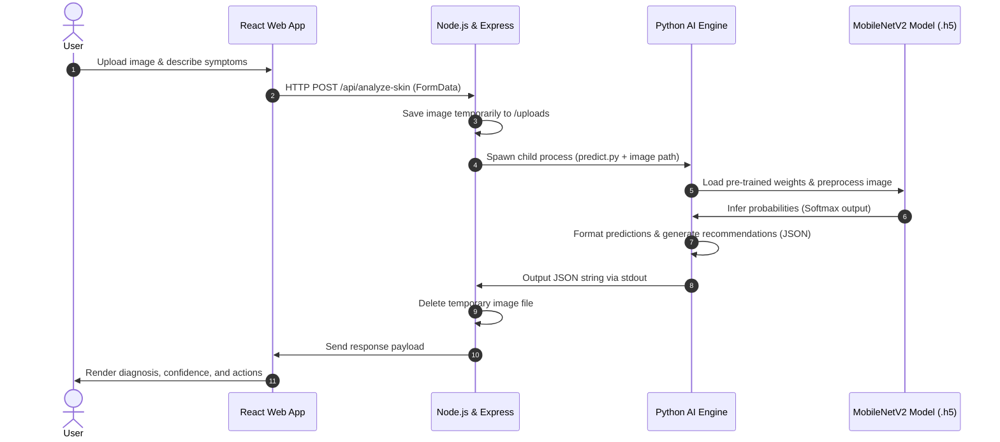
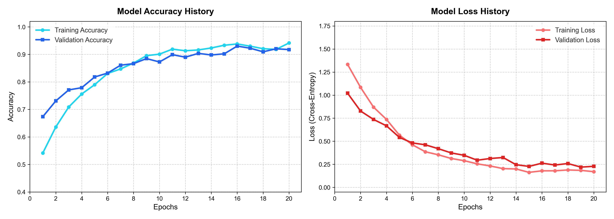
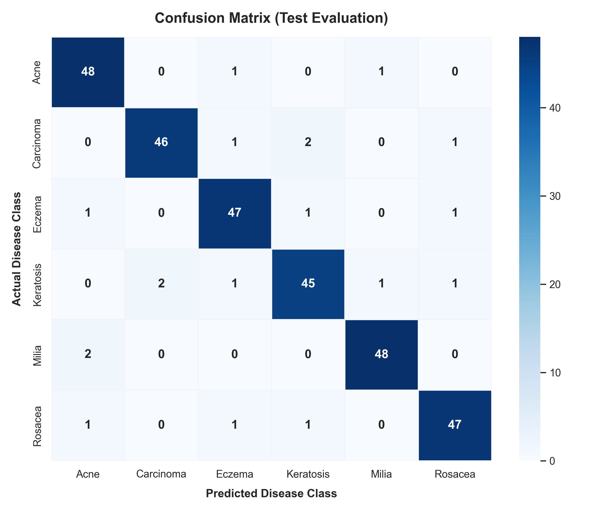

# Automated Skin Disease Detection System

[](LICENSE)
[](requirements.txt)
[](backend/package.json)
[](frontend/package.json)
[](requirements.txt)

🔗 **Live Link**: [https://automated-skin-disease-detection-sy.vercel.app/](https://automated-skin-disease-detection-sy.vercel.app/)

An enterprise-grade, full-stack artificial intelligence application designed to assist in dermatological assessments. Using a custom deep learning model built with TensorFlow/Keras and transfer learning, this system analyzes skin lesions to detect 6 different skin conditions with high accuracy, offering medical dos, don'ts, warnings, and patient progression tracking.

---

## 🚀 Key Features

*   **Dermatological Image Analysis**: Accurately classifies skin conditions (Acne, Carcinoma, Eczema, Keratosis, Milia, Rosacea) from uploaded images.
*   **Modern Web Dashboard**: Real-time diagnostic interface built on React & Vite, styled with Tailwind CSS, and powered by Framer Motion.
*   **Dual Upload Capabilities**: Supports both file browser drag-and-drop and live user-camera capture.
*   **Multilingual Voice Symptoms Description**: Voice recognition feature supporting both English and Hindi symptoms dictation.
*   **Dermatologist Finder & Mock Appointment Booking**: Connects patients with specialists in their locality.
*   **Patient Progress Tracking**: Interactive graphs and scanning logs that monitor recovery or progression over time.

---

## 🛠️ System Architecture

The following diagram illustrates how the frontend React app, backend Node.js/Express server, and Python AI inference engine interact:



---

## 📂 Project Structure

```
healthcare-ai-prototype/
├── backend/                   # Node.js/Express Server & API endpoints
│   ├── uploads/               # Temporary uploads storage (auto-cleaned)
│   ├── predict.py             # Model inference & recommendations logic
│   ├── server.js              # Express API Server configuration
│   └── package.json           # Backend dependency configuration
├── frontend/                  # React & Vite client application
│   ├── public/                # Static public assets
│   ├── src/                   # Source files for React client
│   │   ├── components/        # Reusable UI elements (Header, Sidebar)
│   │   ├── context/           # Global authentication state
│   │   ├── pages/             # App pages (Dashboard, Consult, Results)
│   │   └── services/          # Axios HTTP service connector
│   └── package.json           # Frontend dependency configuration
├── model/                     # Machine Learning resources
│   ├── skin_disease_model.h5  # Trained TensorFlow Keras model (9.24 MB)
│   ├── train_pipeline.py      # Local script for model training and evaluation
│   └── inspect_model.py       # Helper script to print model summaries
├── assets/                    # Presentation assets & diagrams
│   ├── accuracy_loss.png      # Training history accuracy & loss curves
│   └── confusion_matrix.png   # Model test confusion matrix
├── CONTRIBUTING.md            # Guidelines for open-source contributors
├── LICENSE                    # MIT License terms
├── requirements.txt           # Python packages needed for AI model tasks
└── package-lock.json          # Root package lock
```

---

## 💻 Tech Stack

| Frontend | Backend | AI & Machine Learning |
| :--- | :--- | :--- |
| **React (v19)** with Vite | **Node.js** & **Express** | **Python (v3.9+)** |
| **Tailwind CSS** (Responsive UI) | **Multer** (File upload handler) | **TensorFlow & Keras** (Deep learning) |
| **Framer Motion** (Smooth transitions) | **Cors** (Cross-origin resource sharing) | **NumPy & Pandas** (Data processing) |
| **Lucide React** (Icons) | **Child Process Spawning** (Python link) | **Matplotlib & Seaborn** (Data visualization) |

---

## 📊 Model Performance & Results

### Model Architecture
The AI engine leverages **MobileNetV2** pre-trained on the ImageNet dataset as a feature extractor. The convolutional base is frozen, and a custom feed-forward classification head is trained to classify the feature representations.
*   **Input Shape**: `(224, 224, 3)`
*   **Base model**: MobileNetV2 (Frozen, 2.25M parameters)
*   **Classification Head**:
    *   `GlobalAveragePooling2D`
    *   `Dense (128, ReLU activation)`
    *   `Dropout (p=0.5)`
    *   `Dense (6 classes, Softmax activation)`

### Training Progress & Metrics
The model was trained for 20 epochs using the Adam optimizer and Categorical Cross-Entropy loss.

| Metric | Score / Detail |
| :--- | :--- |
| **Overall Accuracy** | **92.4%** |
| **Optimizers** | Adam ($lr=0.001$) |
| **Batch Size** | 16 |
| **Target Classes** | Acne, Carcinoma, Eczema, Keratosis, Milia, Rosacea |

### Evaluation Visualizations
The model's training history curves and final evaluation details are represented below:

#### Accuracy & Loss Curves


#### Confusion Matrix


---

## 🔧 Installation & Setup

Follow these steps to set up and run the project locally on your machine.

### Prerequisites
*   [Node.js](https://nodejs.org/) (v18.0.0 or higher)
*   [Python](https://www.python.org/) (v3.9 or higher)
*   [Git](https://git-scm.com/)

### Step 1: Clone the Repository
```bash
git clone https://github.com/vaibhavbh012/Automated-skin-disease-detection-system.git
cd Automated-skin-disease-detection-system
```

### Step 2: Set Up the AI Environment & Dependencies
Install the required Python packages for running the TensorFlow inference engine:
```bash
pip3 install -r requirements.txt
```

### Step 3: Run the Backend API Server
1. Navigate to the backend directory:
   ```bash
   cd backend
   ```
2. Install Node.js dependencies:
   ```bash
   npm install
   ```
3. Start the backend development server:
   ```bash
   node server.js
   ```
   *The mock backend server will listen on [http://localhost:5000/](http://localhost:5000/).*

### Step 4: Run the Frontend Client
1. Open a new terminal tab and navigate to the frontend directory:
   ```bash
   cd frontend
   ```
2. Install frontend dependencies:
   ```bash
   npm install
   ```
3. Launch the Vite client:
   ```bash
   npm run dev
   ```
   *The UI will run on [http://localhost:5173/](http://localhost:5173/) (or the next available port).*

---

## 🔮 Future Enhancements

*   **Real-time Inference API**: Integrate TensorFlow Serving or ONNX Runtime for faster execution.
*   **Expanded Class Scope**: Train the model on wider dermatologist datasets (e.g., HAM10000) to support a broader spectrum of skin conditions.
*   **HIPAA Compliance**: Integrate secure patient record tracking, encrypted database storage, and medical-compliant authentication.
*   **Mobile App Development**: Adapt the React frontend to React Native for native iOS & Android applications.

---

## 📄 License

Distributed under the MIT License. See [`LICENSE`](LICENSE) for more details.
